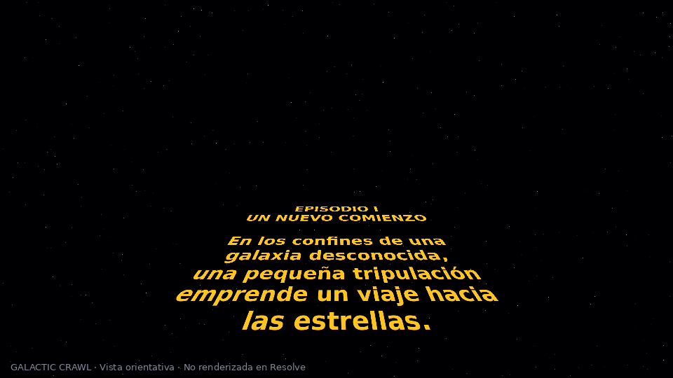

# Galactic Crawl

Título Fusion reutilizable para **DaVinci Resolve 21**, con texto que asciende en perspectiva y se pierde en un fondo de estrellas editable. Inspirado en las aperturas de aventuras espaciales.

[](https://github.com/pacoestrada/galactic-crawl-fusion-title/releases/tag/v0.1.0-beta.1)
[](LICENSE)
[](https://github.com/pacoestrada/galactic-crawl-fusion-title/actions/workflows/validate.yml)

**Primera beta: la sintaxis y el paquete están comprobados; la instalación, los controles y el render dentro de Resolve están pendientes de prueba.** La validación automática no acredita compatibilidad visual ni rendimiento.



[Ver o descargar la animación orientativa de 30 segundos](https://github.com/pacoestrada/galactic-crawl-fusion-title/raw/refs/heads/main/docs/galactic-crawl-preview.mp4). Es una simulación de las fórmulas del título, **no un render de Fusion**. La leyenda inferior no forma parte del título instalable.

## Descargar la beta

- **[Descargar Galactic-Crawl.drfx](https://github.com/pacoestrada/galactic-crawl-fusion-title/releases/download/v0.1.0-beta.1/Galactic-Crawl.drfx)** — paquete recomendado para instalar.
- [Abrir la página de la versión v0.1.0-beta.1](https://github.com/pacoestrada/galactic-crawl-fusion-title/releases/tag/v0.1.0-beta.1).
- [Descargar Galactic-Crawl.setting](https://github.com/pacoestrada/galactic-crawl-fusion-title/releases/download/v0.1.0-beta.1/Galactic-Crawl.setting) — alternativa manual.
- [Guía rápida en español](https://github.com/pacoestrada/galactic-crawl-fusion-title/releases/download/v0.1.0-beta.1/Galactic-Crawl-quickstart-es.txt).
- [Sumas SHA-256](https://github.com/pacoestrada/galactic-crawl-fusion-title/releases/download/v0.1.0-beta.1/SHA256SUMS.txt).

En la página de la versión, abre **Assets** y descarga el `.drfx`. No necesitas descargar el repositorio entero ni descomprimir el instalador. Esta versión es una **pre-release**: los enlaces apuntan a su etiqueta concreta, no a `releases/latest`.

## Instalar en DaVinci Resolve

1. Descarga **Galactic-Crawl.drfx** desde el enlace anterior.
2. Abre un proyecto de Resolve y entra en la página **Fusion**.
3. Arrastra el archivo descargado desde el gestor de archivos a la página Fusion.
4. Confirma la instalación cuando aparezca el diálogo.
5. En **Editar → Biblioteca de efectos → Títulos**, busca **Galactic Crawl**.
6. Arrástralo a la línea de tiempo y dale entre **60 y 90 segundos** para la primera prueba.
7. Selecciona el clip y abre el **Inspector** para editar texto y fondo.

Si el doble clic abre Resolve correctamente, también puedes usarlo. Si el título no aparece tras instalarlo, reinicia Resolve.

### Instalación manual en Linux

Descarga `Galactic-Crawl.setting`, **renómbralo a `Galactic Crawl.setting`** y cópialo a:

```text
~/.local/share/DaVinciResolve/Fusion/Templates/Edit/Titles/
```

Puedes localizar la carpeta desde **Fusion → Biblioteca de efectos → Templates → Edit → Titles → menú de tres puntos → Show Folder / Mostrar carpeta**. Crea las carpetas que falten, respetando las mayúsculas, y reinicia Resolve.

Utiliza un solo método de instalación para evitar títulos duplicados. Si ya instalaste la copia local de esta beta, elimina esa instalación antes de probar la descarga de GitHub; conserva antes cualquier modificación propia.

## Qué puedes editar

### Texto y movimiento

| Control del Inspector | Valor inicial | Uso |
| --- | ---: | --- |
| Texto de la historia | Relato de ejemplo | Texto multilínea; introduce los saltos de línea manualmente. |
| Tipografía / Estilo | DejaVu Sans / Bold | Selecciona una fuente instalada. La fuente no se incluye. |
| Tamaño del texto | 0,05 | Reduce el tamaño para líneas más largas o más texto. |
| Color del texto | Amarillo | Color y transparencia de las letras. |
| Velocidad (1 = normal) | 1 | Multiplica la velocidad; puedes escribir valores superiores a 1. |
| Altura del horizonte | 0,78 | Posición vertical del punto de fuga. Prueba 0,65–0,90. |
| Perspectiva | 0,18 | Acortamiento de la columna hacia el fondo. |
| Ancho de la columna | 0,95 | Anchura del texto proyectado. |
| Desvanecimiento al fondo | 0,16 | Suavidad con la que desaparece cerca del horizonte. |
| Posición inicial | 0,82 | Auméntala si la historia ya aparece al comenzar. |
| Recorrido total | 2,4 | Distancia recorrida durante la duración del clip. |

Con los demás controles sin cambios, al **alargar el clip** la animación se ralentiza. El texto se desvanece durante el último 8 % del clip; el fondo permanece. Una velocidad muy baja puede impedir que termine de pasar todo el relato antes de ese desvanecimiento.

La beta usa un lienzo interno de texto de **1920 × 4096**, sin ajuste automático de líneas. Empieza con unas **20–25 líneas cortas**; si añades mucho texto, reduce su tamaño y revisa que no se corte. La posición inicial y el recorrido necesitan reajuste si cambias mucho la longitud. Puedes partir del [texto de ejemplo](docs/example-text-es.txt).

### Fondo de estrellas

| Control | Valor inicial | Uso |
| --- | ---: | --- |
| Cantidad de estrellas | 0,08 | Densidad; 0 elimina las estrellas. |
| Brillo de estrellas | 0,8 | Intensidad de los puntos. |
| Tamaño de estrellas | 0,35 | Tamaño de los puntos. |
| Distribución de estrellas | 0,25 | Cambia sus posiciones; es una semilla, no una animación. |
| Opacidad del fondo | 1 | 1 muestra el espacio; 0 deja transparente todo el fondo. |
| Color del espacio | Azul casi negro | Selector RGB del fondo. |

Para usar **tu propia imagen o vídeo**, colócalo en una pista inferior y pon **Opacidad del fondo = 0**. No hay un selector de archivo en el Inspector: el reemplazo se realiza con la pista inferior. Los valores intermedios mezclan el espacio del título con lo que haya debajo. La opacidad del fondo no modifica el texto.

Las estrellas son estáticas y se generan dentro de Fusion. El paquete no enlaza imágenes externas ni incluye música, logotipos o material de películas.

## Probar exactamente lo descargado

Sigue la [prueba de descarga e instalación](docs/TESTING.md). Permite distinguir un problema de GitHub o de descarga de uno de instalación, tipografía, controles o render de Fusion.

Para comunicar una incidencia, usa [Issues → Bug report](https://github.com/pacoestrada/galactic-crawl-fusion-title/issues/new?template=bug_report.yml) e incluye la versión de Resolve, edición Free/Studio, sistema operativo, resolución, fps y el paso que falla.

## Compatibilidad y alcance de la validación

- **Destino de esta beta:** DaVinci Resolve 21 en Linux; primera prueba recomendada a 1920 × 1080, horizontal.
- **Herramientas utilizadas:** `TextPlus`, `Background`, `Custom` y `Merge`, dentro de un `GroupOperator`.
- **Comprobado:** lectura y sintaxis con el runtime instalado de Fusion, referencias internas, estructura del `.drfx` y coincidencia de archivos.
- **Pendiente:** instalación real, render, reconocimiento de los controles y rendimiento en Resolve Free/Studio; otros sistemas y formatos de imagen.

Consulta [VALIDATION.md](VALIDATION.md) para ver las comprobaciones exactas. No se presenta esta beta como una versión estable.

## Desarrollo

```text
src/       Macro Fusion editable
dist/     Instalador, alternativa manual, guía rápida y SHA-256
docs/     Vistas orientativas, arquitectura y guía de pruebas
tools/    Validación portable y comprobación nativa opcional
.github/   Validación automática y formularios de incidencias
```

Para validar localmente, usa Python 3.10 o posterior y Lua 5.4 como biblioteca compartida (`liblua5.4-0` en Debian/Ubuntu):

```sh
python3 tools/validate_release.py
```

La validación se repite en GitHub Actions. El instalador de esta beta conserva los mismos bytes que el archivo preparado antes de la publicación. [Arquitectura y empaquetado](docs/ARCHITECTURE.md).

## Autoría y licencia

Diseño, dirección y publicación: **Paco Estrada**. Implementación y documentación desarrolladas con ayuda de OpenAI Codex. Licencia [MIT](LICENSE), como [70 TV](https://github.com/pacoestrada/70-tv-fusion-title).

Proyecto independiente. Consulta [THIRD_PARTY_NOTICES.md](THIRD_PARTY_NOTICES.md) para las notas de fuentes y marcas.

[English](README.en.md)
